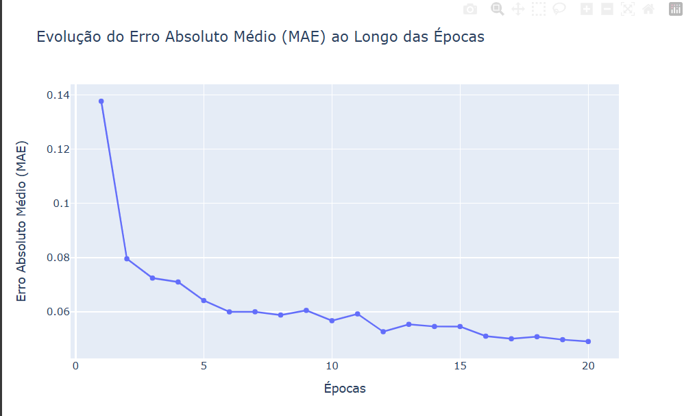

# Métricas

Como métrica foi selecionada a **MAE (Mean Absolute Error)**, pois ela é usada em problemas de regressão para medir o erro absoluto médio das previsões. Ela calcula a média das diferenças absolutas entre os valores previstos e reais, oferecendo uma visão clara do erro médio do modelo em termos das unidades dos dados. É útil quando você deseja entender o erro médio sem penalizar erros maiores mais severamente, como no MSE. Além disso, já está sendo usada a MSE na função de perda, então para não ficar redondante, será utilizada a MAE. É importante o uso dessas métricas, pois outras métricas como acurácia, F1-score, etc., servem para problemas de classificação e, neste caso, é de regressão.

Também foi utilizada a **LOSS (Perda)**, que é padrão na rede neural, medindo o quão bem o modelo está se ajustando aos dados de treinamento. Durante o treinamento, o objetivo é minimizar a perda para melhorar a precisão das previsões do modelo.

# Resultados

A partir dos resultados, percebe-se que o modelo está predizendo os 50 dias. O modelo não está com overfitting; ele começa errando com a loss e a MAE bem ruins, minimizando de acordo com o treinamento.

## Gráfico da Loss

## Gráfico da MAE

## Gráfico de Comparação das Previsões

Com a comparação percebe-se que o modelo não está tão assertivo, talvez seja necessário adicionar mais dias, é importante notar que apesar de todas as variáveis que influenciam a quantidade de vacinação no dia, o modelo de rede neural está conseguindo ficar bem próximo, porém há oportunidades de melhorias.

