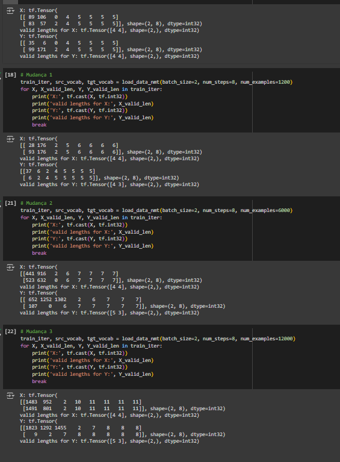

# Respostas

## Tente valores diferentes do argumento num_examples na funçãoload_data_nmt. Como isso afeta os tamanhos do vocabulário do idioma de origem e do idioma de destino?

Para esta questão, foram testados quatro cenários: o primeiro seguindo a documentação com 600 exemplos, o segundo com 1200, o terceiro com 6000 e o último com 12000 exemplos, conforme ilustrado na imagem do notebook abaixo:

Os resultados mostram que, à medida que o número de exemplos aumenta, o vocabulário também se expande, permitindo que mais palavras únicas sejam incluídas. Isso leva a uma maior diversificação dos dados, possibilitando que o modelo aprenda novas palavras tanto no idioma de origem quanto no de destino, o que pode melhorar sua capacidade de generalização. O shape dos tensores, no entanto, permanece o mesmo, independentemente do aumento no número de exemplos, o que é importante para manter a consistência dos dados durante o treinamento.

Entretanto, houve uma mudança no tamanho do tensor Y conforme o número de exemplos aumentou. No primeiro caso, tanto X quanto Y tinham o mesmo tamanho [4,4]. Com 1200 exemplos, Y diminuiu para [4,3], e com 6000 e 12000 exemplos, Y variou para [5,3]. Essa variação no comprimento dos dados também impactou os valores do vocabulário. Curiosamente, com 1200 exemplos, o vocabulário foi menor do que o observado com 600 exemplos no Y, comportamento contrário ao esperado. Já nos outros cenários, o vocabulário aumentou significativamente, tanto no X quanto no Y.

Essas observações indicam que ajustar o valor de num_examples afeta diretamente o tamanho e a diversidade do vocabulário, sem alterar a estrutura básica dos dados de entrada e saída, mas com variações inesperadas nos comprimentos de Y dependendo do número de exemplos usados.

## O texto em alguns idiomas, como chinês e japonês, não tem indicadores de limite de palavras (por exemplo, espaço). A tokenização em nível de palavra ainda é uma boa ideia para esses casos? Por que ou por que não?

A tokenização é uma etapa importante do pré-processamento na qual transforma o texto bruto em partes menores, facilitando a análise e o processamento por modelos e algoritmos. Reduzindo a complexidade do texto, ajudando a identificar padrões semânticos e facilitando a vetorização dos textos, que é necessária para alimentar modelos de aprendizado de máquina.

Essa etapa também é importante em idiomas como japonês e chinês, entretanto, essas linguagens possuem estruturas diferentes de línguas latinas, por exemplo. Isso ocorre porque a escrita das palavras usando ideogramas não é a mesma que a fonética, e esses idiomas também não possuem pontuações como vírgula, o que torna mais difícil realizar a tokenização. Entretanto, não é impossível, sendo realizada de forma diferente.

De acordo com o texto ["How Japanese Tokenizers Work"](https://towardsdatascience.com/how-japanese-tokenizers-work-87ab6b256984), os japoneses utilizam um dicionário em forma de grafos chamado "Lattice". A partir disso, a tokenização é feita com o significado mais próximo daquele termo, sendo menos eficiente que a língua portuguesa, por exemplo, onde é necessário apenas olhar os espaços. Outra alternativa, de acordo com o texto ["Tokenizing Asian texts into words with word segmentation models in Spark NLP"](https://www.johnsnowlabs.com/tokenizing-asian-texts-into-words-with-word-segmentation-models-in-spark-nlp/), é utilizar modelos pré-treinados para realizar a tokenização na qual é um método utilizado pelos chineses.

A partir disso, percebe-se que a tokenização é importante nesses idiomas para a redução de custo computacional em modelos de NLP e também para inserir os dados nos modelos. Entretanto, existem diferenças no processo em comparação com outros idiomas, tendo como alternativas modelos pré-treinados, dicionários e até mesmo grafos, dependendo de cada idioma.
